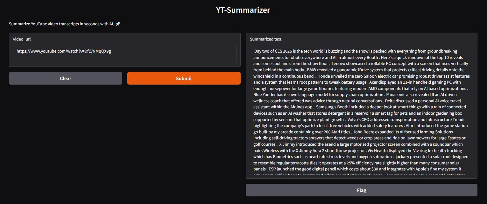

# YT-Summarizer📜

An AI-powered application designed to summarize YouTube video transcripts efficiently. Whether you're a student, researcher, or just curious, save time and get concise summaries of video scripts with this tool. 🚀


---

## 🌟 Features
- **Summarization Made Easy**: Input any YouTube video URL and get a summarized version of the transcript.
- **Chunk Processing**: Handles large transcripts by splitting them into manageable chunks.
- **Accurate Summaries**: Powered by the `distilbart-cnn-12-6` model for state-of-the-art text summarization.
- **Simple User Interface**: Built with Gradio for a user-friendly experience.

---

## ⚙️ How It Works
1. **Extract Video ID**: The app uses a regex to extract the video ID from the given URL.
2. **Fetch Transcript**: Retrieves the transcript using the `youtube-transcript-api`.
3. **Split Large Text**: Divides the transcript into smaller chunks (if necessary) for effective summarization.
4. **Summarize**: Applies a Hugging Face transformer model to generate concise summaries of each chunk.
5. **Display Results**: Outputs the final summarized text in a clean interface.

---

## 🛠️ Technologies Used
- **Python**: Core programming language.
- **Hugging Face Transformers**: For state-of-the-art text summarization.
- **Gradio**: To build an interactive web application.
- **YouTube Transcript API**: For fetching video transcripts.
- **Regular Expressions (Regex)**: To extract video IDs from URLs.

---

## 📋 Requirements
- Python 3.8+
- Libraries: Install the required dependencies using:
  ```bash
  pip install -r requirements.txt
  ```
### Dependencies:
 - transformers
 - gradio
 - youtube-transcript-api
 - torch
  
## 🚀 Usage
1. Clone the repository:
```bash
git clone https://github.com/your-username/AI-YouTube-Transcript-Summarizer.git
cd AI-YouTube-Transcript-Summarizer
```
2. Install the required libraries:
```bash
pip install -r requirements.txt
```
3. Run the app:
```bash
python app.py
```
Open the local Gradio interface in your browser and paste a YouTube video URL to get the summarized transcript.

## 🧪 Technical Details
 - Chunking Strategy: Ensures that each chunk adheres to the token limit of the summarization model (max_length=1024).
 - Transformer Model: Utilizes the distilbart-cnn-12-6 model, pre-trained on the CNN/DailyMail dataset for summarizing long-form text.
 - Error Handling: Manages potential errors during transcript fetching or summarization to ensure smooth performance.

## Acknowledgements
 - Hugging Face team for their amazing pre-trained models and pipelines.
 - Gradio for providing a simple yet powerful interface framework.

## Contact
For any questions or feedback, feel free to reach out:
 - Email: svankalas1@gmail.com
